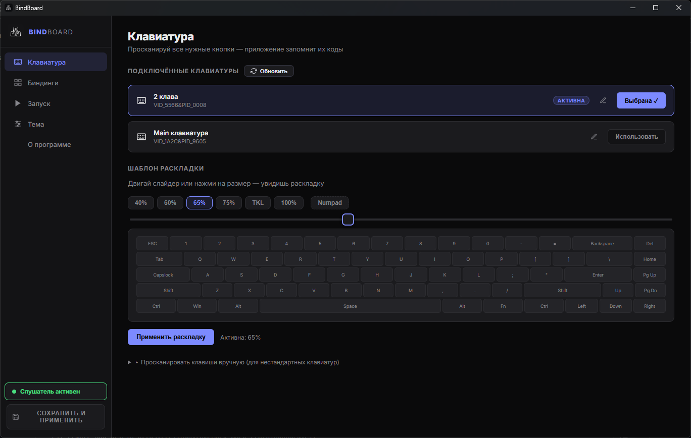
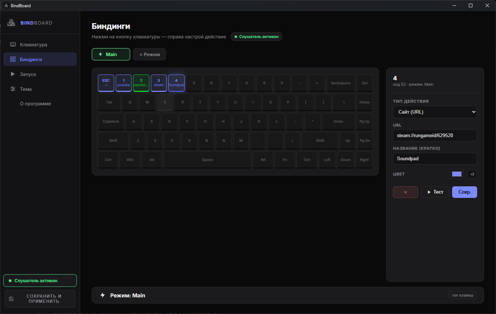
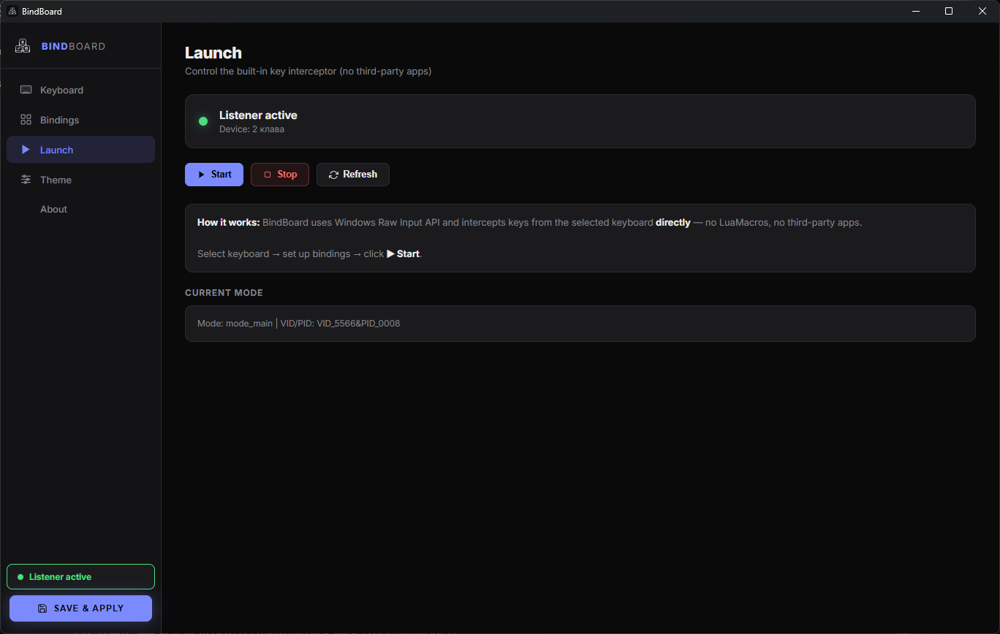
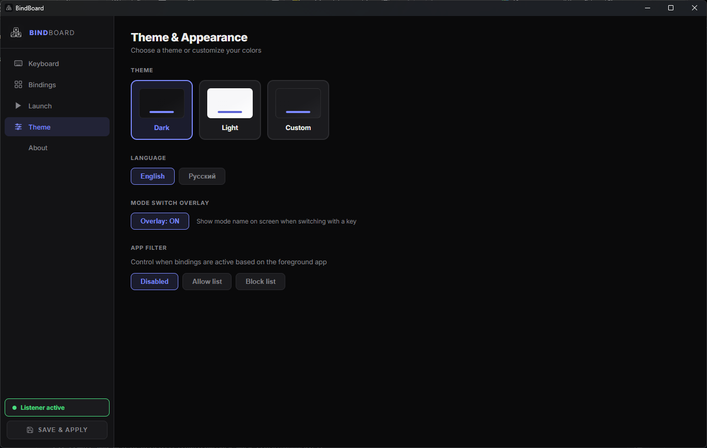

# BindBoard

**BindBoard** — приложение для назначения действий на клавиши второй (макро) клавиатуры.  
Работает через Windows Raw Input — без драйверов и сторонних программ.


---

## Скриншоты

| Клавиатура | Биндинги |
|---|---|
|  |  |

| Запуск | Тема |
|---|---|
|  |  |

---

## Возможности

- 🎹 **Поддержка нескольких клавиатур** — назначай действия конкретно на вторую клавиатуру, первая работает как обычно
- 🗂 **Режимы** — создавай несколько наборов биндингов и переключайся между ними одной клавишей
- 🖥 **Оверлей** — при смене режима на экране мигает подсказка с названием
- 🚀 **Типы действий**: открыть сайт, запустить программу/ярлык, запустить Steam-игру, звук через Soundpad, сменить режим
- 🔍 **Apps-picker** — выбирай программы и Steam-игры по названию, без ручного ввода путей и ID
- 🌐 **Русский и английский интерфейс** — автоопределение по языку системы
- 🔔 **Иконка в трее** — программа сворачивается в трей, не мешает работе

---

## Установка

### Готовый EXE (рекомендуется)

1. Перейди в раздел [Releases](../../releases)
2. Скачай `BindBoard.zip`
3. Распакуй в любую папку
4. Запусти `BindBoard.exe`

> Требуется Windows 10/11 с установленным [WebView2 Runtime](https://developer.microsoft.com/ru-ru/microsoft-edge/webview2/) (обычно уже есть на Windows 11)

### Из исходников

**Требования:** Python 3.10+, Windows 10/11

```bash
git clone https://github.com/Mark-mark-228/BindBoard.git
cd BindBoard
pip install -r requirements.txt
python app.py
```

---

## Быстрый старт

1. Запусти **BindBoard**
2. Перейди на вкладку **Клавиатура** → нажми **Обновить** → выбери вторую клавиатуру → **Применить раскладку**
3. Перейди на вкладку **Биндинги** → нажми на любую клавишу → справа выбери действие → **Сохр.**
4. Перейди на вкладку **Запуск** → нажми **Start**

Всё — клавиши работают!

---

## Режимы

Режимы позволяют иметь несколько наборов биндингов на одних и тех же клавишах.

- Нажми **+ Режим** чтобы создать новый профиль
- Назначь любую клавишу на действие **«Сменить режим»** для переключения между ними
- При смене режима на экране появится оверлей с названием

---

## Сборка EXE

```powershell
pip install -r requirements.txt
pyinstaller BindBoard.spec --noconfirm
```

Готовая папка появится в `dist\BindBoard\`.

---

## Структура проекта

```
BindBoard/
├── app.py           — бэкенд: Raw Input, биндинги, трей, API
├── app.html         — интерфейс: SPA на HTML/CSS/JS
├── bindboard.ico    — иконка приложения
├── BindBoard.spec   — конфиг сборки PyInstaller
├── requirements.txt — зависимости Python
├── screenshots/     — скриншоты для README
└── assets/          — иконки и ресурсы интерфейса
```

---

## Зависимости

| Пакет | Назначение |
|---|---|
| `pywebview` | Окно приложения (Chromium WebView2) |
| `pystray` | Иконка в системном трее |
| `Pillow` | Обработка иконок |
| `pyinstaller` | Сборка в EXE (только для разработки) |

---

## Лицензия

MIT — можно использовать, изменять и распространять свободно.
